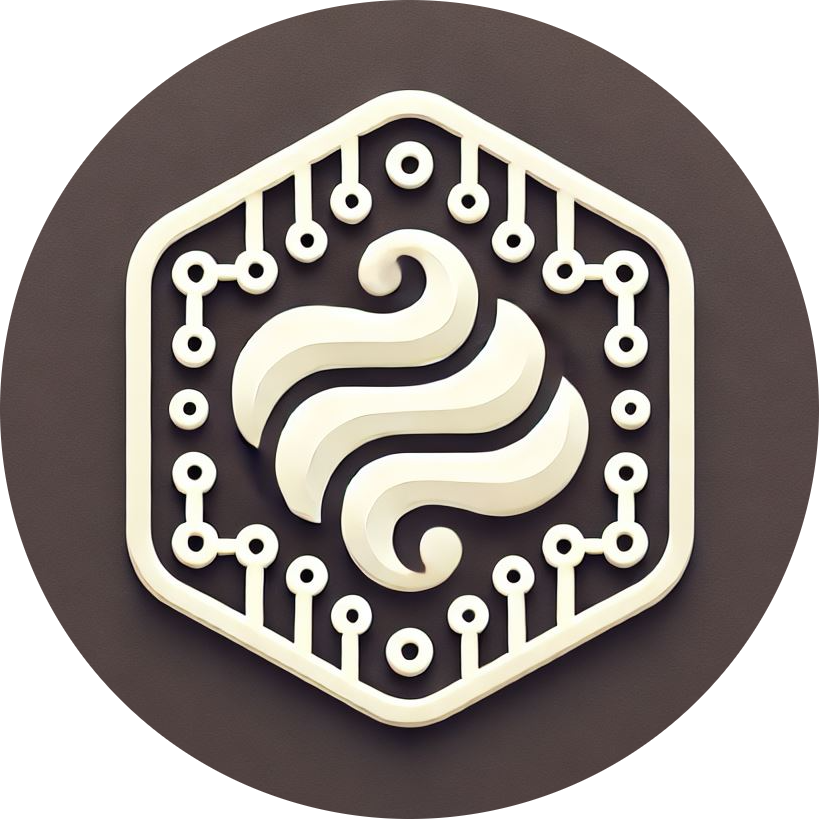

<div align="center">
  

  <h3 align="center">Vanilla AI Agents</h3>

<a href="https://github.com/azure-samples/vanilla-aiagents/main/LICENSE.md"></a>
<a href="https://github.com/Azure-Samples/vanilla-aiagents/actions/workflows/pytest.yml"></a>
<a href="https://github.com/Azure-Samples/vanilla-aiagents/releases"></a>
<a href="https://Azure-Samples.github.io/vanilla-aiagents/"></a>
<a href="https://semver.org/"></a>

  <p>Lightweight library demonstrating how to create agenting application without using any specific framework.</p>
</div>

## Table of Contents

- [Features](#features)
- [Future work](#future-work)
- [Getting Started](#getting-started)
- [Demos](#demos)
- [Testing](#testing)
- [License](#license)
- [Contributing](#contributing)

## Features

This project framework provides the following features:

- Multi-agent chat with several orchestration options
  - Dynamic routing (including option to look for available tools to decide)
  - Beforehand planning with optional repetition via feedback loop
- Agent state management
- Custom stop conditions
- Interactive or unattended user input
- Chat resumability
- Function calling on agents
- Constrained agent routing
- Sub-workflows
- Simple RAG via function calls
- Image input support
- Ability to run pre and post steps via Sequence
- Conversation context "hidden" variables, which are not displayed to the user but agents can read and write to access additional information
- Usage metrics tracking per conversation, plus internal log for debuggability
- Multiple strategies for agent to filter conversation messages (All, last N, top K and Last N, summarize, etc..)
- LLMLingua (`extras` module) support to compress system prompts via strategies
- LLM support for Structured Output
- Remoting support ((`remote` module)), allowing agents to be run on a remote server and accessed elsewhere
  - REST and gRPC channels supported
  - Default implementation to run hosts with agent discovery and registration
- Generated Code execution locally and via ACA Dynamic Sessions
- Streaming support, even over REST or gRPC agents

## Future work

- Plugins
  - Azure AI Search plugin
  - DB plugin
  - API plugin
- DAPR integration
- Multi-agent chat with multiple users

## Getting Started

### Prerequisites

Python 3.11 or later is required to run this project.

### Quickstart

```powershell
git clone https://github.com/Azure-Samples/vanilla-aiagents

cd "vanilla-aiagents"

# Create a virtual environment
python -m venv .venv

# Activate the virtual environment

# On Windows
.\.venv\Scripts\activate
# On Unix or MacOS
source .venv/bin/activate

# Install the required dependencies
pip install -r requirements.txt

# Clone .env.sample to .env and update the values
cp .env.sample .env
```

Here is a simple example of how to use the framework:

```python
import os
from vanilla_aiagents.llm import AzureOpenAILLM
from vanilla_aiagents.agent import Agent
from vanilla_aiagents.team import Team
from vanilla_aiagents.workflow import Workflow

llm = AzureOpenAILLM({
    "azure_deployment": os.getenv("AZURE_OPENAI_MODEL"),
    "azure_endpoint": os.getenv("AZURE_OPENAI_ENDPOINT"),
    "api_key": os.getenv("AZURE_OPENAI_KEY"),
    "api_version": os.getenv("AZURE_OPENAI_API_VERSION"),
})

# Initialize agents and team
sales = Agent(id="sales", llm=llm, description="A sales agent", system_message="""
You are a sales assistant. You provide information about our products and services.

# PRODUCTS
- Product 1: $100, description
- Product 2: $200, description
- Product 3: $300, description
""")
support = Agent(id="support", llm=llm, description="A support agent", system_message="""
You are a support assistant. You provide help with technical issues and account management.

# SUPPORT GUIDELINES
- For technical issues, please provide the following information: ...
- For account management, please provide the following information: ...
""")
team = Team(id="team", description="Contoso team", members=[sales, support], llm=llm)

# Create a workflow
workflow = Workflow(askable=team)

# Run the workflow
result = workflow.run("Hello, I'd like to know more about your products.")
print(workflow.conversation.messages)
```

## Demos

`notebooks` folder contains a few demo notebooks that demonstrate how to use the framework in various scenarios.

## Testing

To run the tests, execute the following command:

```bash
invoke test
```

To run run selected tests, execute the following command:

```bash
invoke test --test-case <test_case>
```

Testing also includes code coverage.

## Building

To build the project, run the following command:

```bash
invoke build --version <version>
```

Output wheel will be available in the `dist` folder under `vanilla_aiagents` with naming `vanilla_aiagents-<version>-py3-none-any.whl`.

## License

This project is licensed under the MIT License - see the [LICENSE](LICENSE) file for details.

## Contributing

We welcome contributions! Please see [CONTRIBUTING.md](CONTRIBUTING.md) for details on how to contribute.
