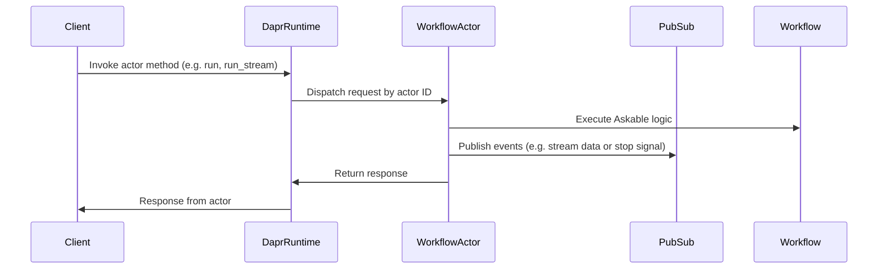

# Workflows as Actors

Vanilla also offers a Virtual Actor pattern implementation via Dapr. This allows for the hosting of `Workflow` as Dapr Actors, enabling event sourcing and decoupled communication between workflows, along with at-most-one client-to-actor interactions - only one client can interact with an actor at a time.

Being more specific, accessing an actor is done through a unique ID, which is used to identify the actor instance, that in our case matches a `Workflow` instance with its `Conversation`.

## Dapr integration

Dapr is a portable, event-driven runtime that makes it easy for developers to build resilient, microservice stateful applications. It offers a Virtual Actor pattern implementation, which allows for the hosting of `Workflow` as [Actors](https://docs.dapr.io/developing-applications/building-blocks/actors/actors-overview/) enabling event sourcing and decoupled communication between workflows via [PubSub](https://docs.dapr.io/developing-applications/building-blocks/pubsub/).

Thanks to Dapr components, Vanilla is independent of the underlying infrastructure, and can run on any platform that supports Dapr, such as `Azure Cosmos DB` for state management and `Azure Service Bus` for PubSub.

## Comparing to Remote Agents

The key difference between is standard remoting simply offers **stateless** agents, while Dapr Actors offer **stateful** workflows. This means that Dapr Actors can maintain state across multiple interactions, while remote agents are simply APIs that are called and return a result.

See the [Remote Agents documentation](remote.md) for more information.

## Specification

`vanilla_aiagents.remote.actors` provides the `WorkflowActor` class, which is simple wrapper around a `Workflow` instance with these main methods:

- `run`: Runs the `Workflow` instance with the configured `Askable` over the actor's `Conversation` state.
- `run_stream`: Runs the `Workflow` instance with the configured `Askable` over the actor's `Conversation` state, but in streaming outputs as PubSub events.
- `get_conversation`: Gets the current state of the `Conversation` in the actor.

Additionally, `vanilla_aiagents.remote.run_actors` provides a simple entrypoint to run a Dapr actor host with the `WorkflowActor` instances, and implements a PubSub event handler to receive `input` events to relay to the actors.

## Diagram

When a client calls an actor method (for example, `WorkflowActor.run`), Dapr locates the correct `WorkflowActor` by its unique ID and forwards the request. The actor then runs the `Workflow` with the provided input and can publish interim events to PubSub (if using `run_stream`). Finally, the actor sends its result back to the Dapr runtime, which returns it to the client.

## Events format

All events are sent as JSON strings following Dapr's PubSub conventions, leveraging CloudEvent v1 format. `vanilla_aiagents.remote.actors` provides a `WorkflowEvent` class to help with event serialization and deserialization, along with proper subclasses for each event type.

All events have the following attributes:

- `id`: The conversation ID, which is unique to the `Workflow` instance.
- `type`: The event type, which can be `input`, `stream`, `update` or `stop`.

Specific event types have additional attributes:

- `input`: The input event, which is the input to the `Workflow` instance.
  - `input`: The input data to the `Workflow` instance.
- `stream`: The stream event, which is the partial output of the `Workflow` instance.
  - `mark`: The mark of the stream event.
  - `content`: The partial output of the `Workflow` instance.
- `stop`: The stop event, which is the signal to stop the `Workflow` instance.
  - `source`: The source `Askable` of the stop signal.
- `update`: The update event, which is the signal to update the `Conversation` state.
